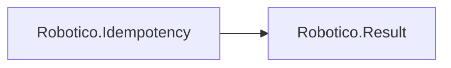

# Robotico.Idempotency

[](https://github.com/robotico-dev/robotico-idempotency-csharp/actions/workflows/publish.yml)
[](https://dotnet.microsoft.com/download/dotnet/8.0)
[](https://dotnet.microsoft.com/download/dotnet/10.0)
[](https://github.com/robotico-dev/robotico-idempotency-csharp/packages)

Command idempotency for APIs and messaging. IIdempotencyStore and Result-based API. Depends on Robotico.Result.

## Robotico dependencies



## Installation

```bash
dotnet add package Robotico.Idempotency
```

## Quick start

```csharp
using Robotico.Idempotency;
using Robotico.Result;

// Inject IIdempotencyStore (implement with your storage)
Result r = await store.TryClaimAsync("request-id-123");
if (r.IsSuccess())
{
    // Key claimed; process the command once.
}
else
{
    // Key already used; return cached response or 409.
}
```

## Documentation

Design and usage docs (AsciiDoc) are in the `docs/` folder:

- **Design** (`docs/design.adoc`) — Idempotency pattern, API contract, key semantics, integration with Robotico.Outbox.
- **Index** (`docs/index.adoc`) — Quick links and how to build the docs.

To build HTML (e.g. with Asciidoctor): `asciidoctor docs/index.adoc -o docs/index.html` and `asciidoctor docs/design.adoc -o docs/design.html`.

## Building and testing

```bash
dotnet restore
dotnet build -c Release
dotnet test -c Release --collect:"XPlat Code Coverage"
```

Optional CI gate (90% line coverage): `dotnet test ... --collect:"XPlat Code Coverage" /p:CollectCoverage=true /p:Threshold=90 /p:ThresholdType=line`

## Related packages

- **Robotico.Outbox** — Combine with the transactional outbox for exactly-once delivery.
- **Robotico.Resilience** — Retry when claiming or when the store is temporarily unavailable.
- **Robotico.Validation** — Validate idempotency key format before calling `TryClaimAsync`.

## License

See repository license file.
