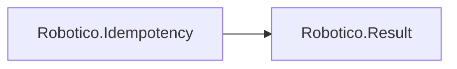

# Robotico.Idempotency

[](https://dotnet.microsoft.com/download/dotnet/8.0)
[](https://dotnet.microsoft.com/download/dotnet/10.0)
[](https://github.com/robotico-dev/robotico-idempotency-csharp/packages)

Command idempotency for APIs and messaging. IIdempotencyStore and Result-based API. Depends on Robotico.Result.

## Robotico dependencies



## Installation

```bash
dotnet add package Robotico.Idempotency
```

## License

See repository license file.
